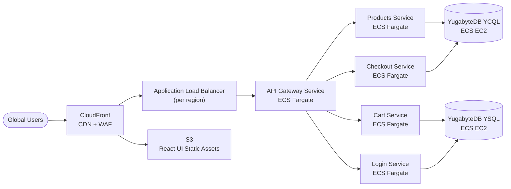

# Yugastore Global E-Commerce — AWS Infrastructure & Architecture

## Problem Statement

Yugastore is a Java/Spring Boot microservices e-commerce application currently running only via local Docker. It needs production-grade AWS infrastructure for a **global e-commerce** deployment, with Terraform IaC, GitHub Actions CI/CD, and AI-powered PR reviews.

## Current State

* **6 microservices** + React UI, each with a Dockerfile (Java 17, Spring Boot 2.6.3)
* **YugabyteDB** as the datastore (YCQL for products/checkout, YSQL for cart/login)
* **Eureka** for local service discovery — will be replaced by AWS Cloud Map in cloud
* No existing Terraform, no CI/CD pipelines, no cloud deployment

## Architecture Overview

### Traffic Flow

### Networking & Edge Layer

* **CloudFront** distribution as the single global entry point
    * Origin 1: S3 bucket serving the React UI static build (`react-ui/frontend/build/`)
    * Origin 2: Regional ALB for API traffic (`/api/*` path pattern)
    * AWS WAF attached for bot protection, rate limiting, geo-blocking
    * TLS termination at edge, custom domain via Route 53
* **Application Load Balancer** (internal, per-region)
    * Listener rules route to ECS target groups by path prefix
    * `/api/*` → api-gateway-microservice target group
    * Health checks per target group
* **Route 53** latency-based routing across regions for multi-region expansion

### Compute — ECS Fargate (Microservices)

All stateless microservices run on **ECS Fargate** (serverless, no EC2 management).

**Dev/demo sizing** (single running task per service, smallest viable Fargate size):

| Service | Container Port | CPU/Memory | Desired Tasks |
|---|---|---|---|
| api-gateway-microservice | 8081 | 256/512 | 1 |
| products-microservice | 8082 | 256/512 | 1 |
| cart-microservice | 8083 | 256/512 | 1 |
| checkout-microservice | 8086 | 256/512 | 1 |
| login-microservice | 8085 | 256/512 | 1 |

* **Auto Scaling**: Disabled in dev (fixed at 1 task per service). Target-tracking on CPU utilization (70% threshold) and ALB request count is wired in via Terraform but only enabled in staging/prod.
* **Production sizing** (planned, applied via `prd.tfvars`): 512/1024 CPU/mem with min/max 2/8–10 tasks per service.
* **Service Discovery**: AWS Cloud Map (replaces Eureka). Each service registers a DNS name in a private namespace (e.g. `products.yugastore.local`). Spring Cloud config updated to use DNS-based discovery instead of Eureka.
* **ECR**: One repository per microservice. Images tagged with git SHA + `latest`.

### Compute — ECS EC2 (YugabyteDB)

YugabyteDB requires **persistent storage and high I/O**, making ECS EC2 the right choice over Fargate.

**Dev/demo sizing** (single-node, demo only — not HA):

* **EC2 Instance Type**: `t3.medium` (burstable, cheapest viable for a demo Yugabyte node) — upgrade to `i3.large`/`r6g.large` in staging/prod for NVMe and steady-state performance.
* **ECS Capacity Provider**: EC2 Auto Scaling Group fixed at 1 instance in a single AZ.
* **EBS Volumes**: single gp3 volume for WAL + data; snapshots optional in dev.
* **YugabyteDB Topology (dev)**: 1 TServer + 1 Master co-located on the single node; RF=1. Both YCQL and YSQL endpoints exposed from the same node. **No HA — for demo only.**

**Production topology** (planned, applied via `prd.tfvars`):

* 3 TServer + 3 Master nodes minimum, one per AZ in a 3-AZ region
* RF=3 for data replication
* Task placement: `distinctInstance` constraint so no two YB nodes share a host
* YCQL endpoint for products/checkout services; YSQL endpoint for cart/login services

### Supporting AWS Services

* **S3**: React UI static hosting, Terraform state backend, DB backups
* **Secrets Manager**: DB credentials, API keys, Spring Boot secrets
* **CloudWatch**: Centralized logging (via awslogs driver), metrics, alarms
* **SNS/SQS**: Alert notifications for scaling events and health issues
* **ACM**: TLS certificates for CloudFront and ALB

## Implementation Phases

### Phase 1: Foundation (Terraform + ECR + Networking)
* Create `infrastructure/` directory structure
* Implement `networking`, `ecr`, and `ecs-cluster` modules
* Set up S3 backend for Terraform state
* Establish dev environment

### Phase 2: Microservices Deployment (ECS Fargate)
* Implement `ecs-service` and `service-discovery` modules
* Update Spring Boot configs to use Cloud Map instead of Eureka
* Deploy all 5 microservices to Fargate
* Implement `alb` module with path-based routing

### Phase 3: Database Layer (ECS EC2 + YugabyteDB)
* Implement `yugabytedb` module with EC2 capacity provider
* Configure EBS volumes and backup strategy
* Data migration scripts and schema deployment

### Phase 4: Edge & CDN (CloudFront + S3)
* Implement `cloudfront` module
* Deploy React UI to S3
* Configure WAF rules
* Set up Route 53 and ACM certificates

### Phase 5: CI/CD Pipelines
* Create all GitHub Actions workflows
* Configure GitHub environments with secrets and protection rules
* Implement AI PR review workflow with Claude API

### Phase 6: Observability & Hardening
* Implement `monitoring` module (CloudWatch dashboards, alarms)
* Add health check endpoints to all services
* Security audit — least-privilege IAM, encryption at rest/transit
* Load testing and auto-scaling validation

## Related Documents

* [terraform.md](terraform.md) — Terraform stack layout and design decisions
* [workflows.md](workflows.md) — GitHub Actions CI/CD and AI-powered PR review
