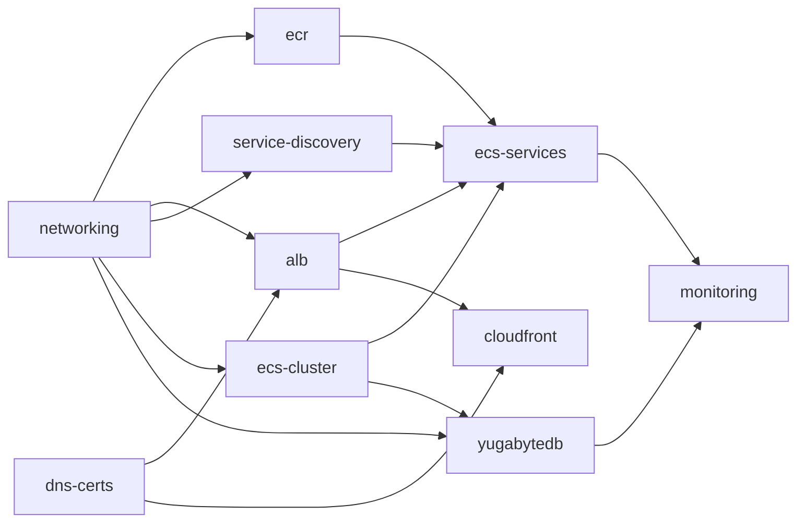

# Yugastore — Terraform Structure

All infrastructure lives under `./yugastore-java/terraform/`. Each stack is a self-contained Terraform root module that uses **official HashiCorp AWS modules** from the Terraform Registry (e.g. `terraform-aws-modules/vpc/aws`, `terraform-aws-modules/ecs/aws`). Environment differentiation is handled via per-stack `.tfvars` files — no duplicated root modules.

## Directory Layout

```text
terraform/
├── stacks/
│   ├── networking/                     # VPC, subnets, NAT GW, security groups
│   │   ├── main.tf                     # uses terraform-aws-modules/vpc/aws
│   │   ├── variables.tf
│   │   ├── outputs.tf
│   │   ├── backend.tf                  # S3 + DynamoDB state locking
│   │   ├── versions.tf                 # required_providers (hashicorp/aws)
│   │   └── envs/
│   │       ├── dev.tfvars
│   │       ├── qa.tfvars
│   │       └── prd.tfvars
│   │
│   ├── ecr/                            # ECR repositories (one per microservice)
│   │   ├── main.tf
│   │   ├── variables.tf
│   │   ├── outputs.tf
│   │   ├── backend.tf
│   │   ├── versions.tf
│   │   └── envs/
│   │       ├── dev.tfvars
│   │       ├── qa.tfvars
│   │       └── prd.tfvars
│   │
│   ├── ecs-cluster/                    # ECS cluster, Fargate + EC2 capacity providers
│   │   ├── main.tf                     # uses terraform-aws-modules/ecs/aws
│   │   ├── variables.tf
│   │   ├── outputs.tf
│   │   ├── backend.tf
│   │   ├── versions.tf
│   │   └── envs/
│   │       ├── dev.tfvars
│   │       ├── qa.tfvars
│   │       └── prd.tfvars
│   │
│   ├── ecs-services/                   # All Fargate microservice task defs + services
│   │   ├── main.tf                     # uses terraform-aws-modules/ecs/aws (service sub-module)
│   │   ├── services.tf                 # per-service definitions (api-gw, products, cart, checkout, login)
│   │   ├── variables.tf
│   │   ├── outputs.tf
│   │   ├── backend.tf
│   │   ├── versions.tf
│   │   └── envs/
│   │       ├── dev.tfvars              # image tags, task counts, CPU/mem per env
│   │       ├── qa.tfvars
│   │       └── prd.tfvars
│   │
│   ├── yugabytedb/                     # ECS EC2 tasks, EBS volumes, placement constraints
│   │   ├── main.tf
│   │   ├── variables.tf
│   │   ├── outputs.tf
│   │   ├── backend.tf
│   │   ├── versions.tf
│   │   └── envs/
│   │       ├── dev.tfvars              # instance type, node count, volume size per env
│   │       ├── qa.tfvars
│   │       └── prd.tfvars
│   │
│   ├── alb/                            # ALB, listeners, target groups, path routing
│   │   ├── main.tf                     # uses terraform-aws-modules/alb/aws
│   │   ├── variables.tf
│   │   ├── outputs.tf
│   │   ├── backend.tf
│   │   ├── versions.tf
│   │   └── envs/
│   │       ├── dev.tfvars
│   │       ├── qa.tfvars
│   │       └── prd.tfvars
│   │
│   ├── cloudfront/                     # CloudFront distro, S3 origin, ALB origin, WAF
│   │   ├── main.tf                     # uses terraform-aws-modules/cloudfront/aws
│   │   ├── variables.tf
│   │   ├── outputs.tf
│   │   ├── backend.tf
│   │   ├── versions.tf
│   │   └── envs/
│   │       ├── dev.tfvars
│   │       ├── qa.tfvars
│   │       └── prd.tfvars
│   │
│   ├── dns-certs/                      # Route 53 zones, ACM certificates
│   │   ├── main.tf                     # uses terraform-aws-modules/acm/aws
│   │   ├── variables.tf
│   │   ├── outputs.tf
│   │   ├── backend.tf
│   │   ├── versions.tf
│   │   └── envs/
│   │       ├── dev.tfvars
│   │       ├── qa.tfvars
│   │       └── prd.tfvars
│   │
│   ├── service-discovery/              # Cloud Map namespace + service registrations
│   │   ├── main.tf
│   │   ├── variables.tf
│   │   ├── outputs.tf
│   │   ├── backend.tf
│   │   ├── versions.tf
│   │   └── envs/
│   │       ├── dev.tfvars
│   │       ├── qa.tfvars
│   │       └── prd.tfvars
│   │
│   └── monitoring/                     # CloudWatch dashboards, alarms, SNS topics
│       ├── main.tf
│       ├── variables.tf
│       ├── outputs.tf
│       ├── backend.tf
│       ├── versions.tf
│       └── envs/
│           ├── dev.tfvars
│           ├── qa.tfvars
│           └── prd.tfvars
│
└── README.md
```

## HashiCorp AWS Modules Used

* `terraform-aws-modules/vpc/aws` — networking stack (VPC, subnets, NAT, IGW, route tables)
* `terraform-aws-modules/ecs/aws` — ECS cluster, capacity providers, Fargate services, task definitions
* `terraform-aws-modules/alb/aws` — ALB, listeners, target groups
* `terraform-aws-modules/cloudfront/aws` — CloudFront distribution, origins, cache behaviors
* `terraform-aws-modules/acm/aws` — ACM certificate provisioning and DNS validation
* `terraform-aws-modules/s3-bucket/aws` — S3 buckets (React UI hosting, Terraform state, DB backups)
* `terraform-aws-modules/security-group/aws` — security groups for each tier (ALB, Fargate, EC2/DB)

## Key Design Decisions

* **Stack-per-concern**: Each stack is an independent Terraform root module with its own state file. Stacks are applied independently, reducing blast radius and enabling parallel team workflows.
* **Environment via tfvars**: A single set of `.tf` files per stack; `dev.tfvars`, `qa.tfvars`, and `prd.tfvars` supply environment-specific values (CIDR ranges, instance sizes, task counts, domain names). Apply with `terraform apply -var-file=envs/dev.tfvars`.
* **State isolation**: Each stack × environment combination has its own S3 state key (e.g. `yugastore/networking/dev/terraform.tfstate`), configured in `backend.tf` with DynamoDB locking.
* **Cross-stack data sharing**: Stacks read sibling outputs via `terraform_remote_state` data sources (e.g. `ecs-services` reads VPC ID and subnet IDs from the `networking` stack's state).
* **No custom modules**: Rely on well-maintained HashiCorp registry modules rather than writing custom wrappers, reducing maintenance burden and leveraging community-tested defaults.

## Stack Dependency Order



## Related Documents

* [aws-infrastructure.md](aws-infrastructure.md) — Architecture overview and AWS service decisions
* [workflows.md](workflows.md) — GitHub Actions CI/CD and AI-powered PR review
