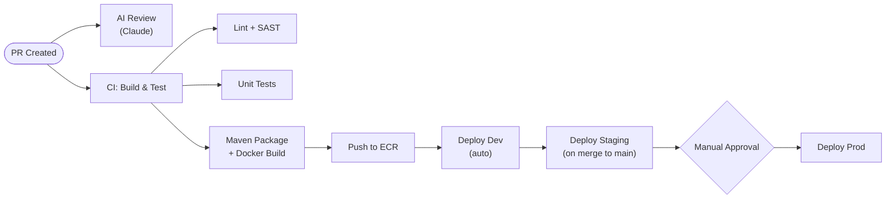

# Yugastore — GitHub Actions Workflows

## Environments

In the future there would be three GitHub environments...initially there will only be 'dev'

## Pipeline Architecture

## Workflow Files

**`.github/workflows/ci.yml`** — Triggered on all PRs and pushes to `develop`/`main`:

* Checkout, setup Java 17, Maven cache
* `mvn verify` — compile, unit tests, integration tests
* Build Docker images for each microservice
* Push images to ECR (tagged with `${{ github.sha }}`)
* Run Trivy container scan

**`.github/workflows/deploy.yml`** — Triggered after CI succeeds:

* Uses `github.environment` to select target (dev/staging/prod)
* Runs `terraform plan` then `terraform apply` for infrastructure changes
* Updates ECS service with new task definition (new image tag)
* Runs smoke tests against deployed environment
* Rollback step on failure (re-deploy previous task definition)

**`.github/workflows/terraform-plan.yml`** — Triggered on PRs that modify `infrastructure/`:

* Runs `terraform fmt -check`, `terraform validate`, `terraform plan`
* Posts plan output as PR comment

**`.github/workflows/react-ui.yml`** — Triggered on changes to `react-ui/frontend/`:

* `npm ci && npm run build`
* Upload build artifacts to S3
* Invalidate CloudFront cache

## AI-Powered PR Review

### Approach: GitHub Actions + Claude API

A dedicated workflow triggers on every PR to provide automated code review:

**`.github/workflows/ai-review.yml`**:

* **Trigger**: `pull_request` events (opened, synchronize)
* **Steps**:
    1. Fetch the PR diff via GitHub API (`gh pr diff`)
    2. Send the diff to Claude API (Anthropic) with a system prompt tailored for Java/Spring Boot code review
    3. Post Claude's review as a PR comment via `gh pr comment`
* **Review focus areas** (configured in system prompt):
    * Security vulnerabilities (SQL injection, auth bypass, secrets in code)
    * Spring Boot anti-patterns and best practices
    * Performance issues (N+1 queries, missing indexes, unbounded collections)
    * Terraform misconfigurations (public S3, open security groups, missing encryption)
    * Test coverage gaps
    * Breaking API changes
* **Secrets required**: `ANTHROPIC_API_KEY` stored in GitHub Actions secrets
* **Cost control**: Max token limit per review, skip reviews on docs-only changes

### Alternative: GitHub Copilot PR Review

If the organization has GitHub Copilot Enterprise, an alternative is enabling Copilot's built-in PR review feature (no custom workflow needed). The Claude API approach above gives more control over review criteria and works without Copilot licensing.

### Measuring AI Review Impact

A scheduled GitHub Actions workflow (`.github/workflows/pr-metrics.yml`) collects PR lifecycle data weekly via the GitHub API and publishes a metrics report. This establishes a **before/after baseline** to quantify the AI reviewer's effect.

#### Baseline Period

Capture 4–6 weeks of metrics **before** enabling the AI reviewer to establish control values. All the same metrics are then tracked continuously after enablement.

#### Key Metrics

**Velocity metrics** (collected via GitHub API — `gh api` calls for PRs, reviews, and timeline events):

* **PR Cycle Time** — elapsed time from PR opened to merged. Primary indicator of overall improvement.
* **Time to First Review** — elapsed time from PR opened to first human review comment. Measures whether AI pre-screening accelerates human engagement (reviewers have less to catch).
* **Revision Rounds per PR** — number of review ↔ push cycles before approval. Fewer rounds = AI is catching issues authors would otherwise miss on first submission.
* **First-Pass Approval Rate** — % of PRs approved by human reviewers on the first review round (no changes requested). Target: measurable increase post-AI-review.

**Quality metrics**:

* **Post-Merge Revert Rate** — PRs reverted within 7 days of merge. A decreasing trend signals the AI reviewer is catching defects before they land.
* **Hotfix Frequency** — emergency fixes to `main` within 48h of a merge. Proxy for defect escape rate.
* **CI Failure Rate on Merge** — % of merges that break the CI pipeline. Should decrease if AI catches build/test issues in review.

**AI-specific metrics** (parsed from AI review comments posted on PRs):

* **AI Finding Count per PR** — average number of issues flagged by the AI reviewer.
* **AI Finding Acceptance Rate** — % of AI-flagged issues that result in a code change before merge (measured by comparing the diff before and after the AI comment). High acceptance = AI is producing actionable, not noisy, feedback.
* **AI Finding Categories** — breakdown of AI findings by type (security, performance, style, correctness). Identifies which review areas the AI is most/least effective at.
* **False Positive Rate** — AI comments explicitly dismissed by the author (e.g. replied with "not applicable" or no code change + approval). Tracks noise level.

#### Collection & Reporting

**`.github/workflows/pr-metrics.yml`** — runs on `schedule: cron('0 9 * * 1')` (weekly Monday 9 AM UTC):

1. Queries GitHub API for all PRs merged in the prior week (and open PRs for in-flight cycle time)
2. For each PR: extracts opened_at, first_review_at, merged_at, review round count, revert status, AI comment count, and whether AI-flagged issues were addressed
3. Computes aggregate metrics and appends to a JSON lines file in S3 (`s3://yugastore-metrics/pr-metrics/YYYY-WW.jsonl`)
4. Generates a markdown summary and posts it to a designated Slack channel or GitHub Discussion

**Dashboard** (Phase 6 deliverable):

* CloudWatch custom metrics published from the weekly JSONL data, or a lightweight Grafana dashboard if the team prefers
* Week-over-week trend lines for cycle time, first-pass approval rate, and AI acceptance rate
* Before/after comparison view anchored to the AI reviewer enablement date

#### Success Criteria

* **PR Cycle Time**: ≥15% reduction within 8 weeks of AI reviewer enablement
* **First-Pass Approval Rate**: ≥20% increase
* **Post-Merge Revert Rate**: ≥25% reduction
* **AI Finding Acceptance Rate**: ≥60% (below this, tune the system prompt to reduce noise)

## Related Documents

* [aws-infrastructure.md](aws-infrastructure.md) — Architecture overview and AWS service decisions
* [terraform.md](terraform.md) — Terraform stack layout and design decisions
