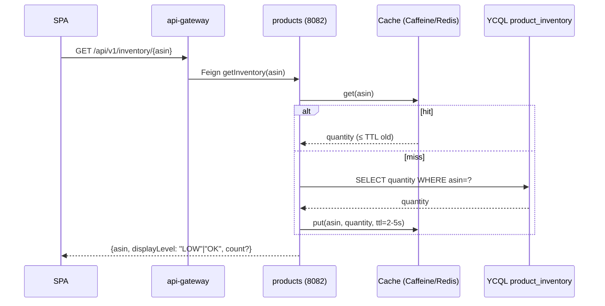
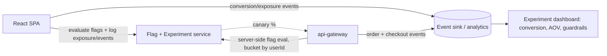

# Cart → Checkout: Friction Analysis & Conversion-Feature Design

> **Context:** Product Owner goal — reduce cart abandonment, raise checkout completion, increase sales.
> **Proposed levers:** (1) scarcity "Only N left in stock", (2) social proof "120 people viewing", (3) highlight reviews/ratings.
> **Constraints:** data shown must be **fast AND accurate**. **Decision (2026-06-01):** tooling must be **open-source** (no license lock-in); **A/B testing is deferred** (nice-to-have, not must-have now) — ship features directly with lightweight on/off toggles + canary for safe rollout, defer the full experiment/measurement platform.
> **Method:** read-only deep dive on the cart flow + data model. No code changed. File:line evidence throughout.

---

## 1. TL;DR for the Product Owner

- The biggest abandonment driver in the current code is **not the absence of scarcity/social-proof — it's that the checkout itself is unreliable and untrustworthy.** The UI shows **"Thank you! Order received" even when checkout fails** (`Cart/index.js:103-106`), checkout can **oversell** because inventory decrement isn't atomic, and identity is **hardcoded to one user** so carts collide. Layering persuasion features on top of a broken checkout will inflate *intent* metrics while *real* conversion and trust suffer.
- **Feasibility of the three features, as the data stands today:**
  | Feature | Data source today | Effort | Verdict |
  |---|---|---|---|
  | **Highlight reviews/ratings** | ✅ Exists (`num_reviews`, `avg_stars`, `num_stars`) and is already partly rendered | **Low** | Ship first — pure UI + flag |
  | **"Only N left in stock"** | ⚠️ Exists in DB (`product_inventory.quantity`) but **not exposed by any API**; accuracy depends on fixing checkout | **Medium** | Needs a new read path + inventory-accuracy fix |
  | **"120 people viewing"** | ❌ **No data source at all** — no view counter anywhere | **High** | Net-new infra (real-time counter) |
- **Recommended sequence:** fix the trust/reliability bugs (quick) → review-highlight behind a simple toggle (quick) → make inventory accurate (atomic checkout, medium) → expose inventory + bucketed scarcity (medium). **A/B experimentation and the "people viewing" counter are deferred** (PO decision); when revisited, use **open-source** tooling only.
- **On "fast AND accurate" inventory:** YugabyteDB *can* give both. The `product_inventory` and `orders` tables are already created with `transactions = {'enabled':'true'}` (`resources/schema.cql:63,69`), so atomic, correct decrements are achievable today — the current code just doesn't use them correctly. Speed comes from a short-TTL cache + event-based invalidation, with display bucketed ("Only a few left") so we don't promise an exact number we can't guarantee.

---

## 2. The current cart → checkout flow (as built)

### 2.1 End-to-end map

```mermaid
sequenceDiagram
    autonumber
    participant U as Shopper (React SPA)
    participant UI as react-ui Spring (8080)
    participant GW as api-gateway (8081)
    participant C as cart (8083, YSQL)
    participant CO as checkout (8086, YCQL)
    participant P as products (8082, YCQL)
    participant DB as YugabyteDB

    Note over U: Browse → product detail (ShowProduct)
    U->>UI: GET /products/details?asin=X
    UI->>GW: GET /api/v1/product/X
    GW->>P: Feign getProductDetails(X)
    P->>DB: SELECT * FROM products WHERE asin=X
    P-->>U: ProductMetadata (title, price, reviews, also_bought[])
    Note over U: ⚠ NO stock, NO "viewing" data in payload

    U->>UI: POST /cart/add?asin=X  (userId hardcoded "u1001")
    UI->>GW->>C: addProduct(u1001, X)
    C->>DB: findById("u1001-X") then UPDATE qty+1 / INSERT
    C-->>U: cart map {asin: qty}

    Note over U: Cart page renders — N+1 detail fetches (one per line item)
    loop each cart item
        U->>UI: GET /products/details?asin=item
    end

    U->>UI: POST /cart/checkout
    UI->>GW->>CO: checkout()  (userId hardcoded "u1001")
    CO->>C: Feign getProductsInCart(u1001)
    loop each item  (×2 — also in getTotal())
        CO->>DB: SELECT product_inventory WHERE asin=?   (read)
        CO->>P: Feign getProductDetails(asin)            (N+1)
        Note over CO: if qty < requested → NotEnoughProductsInStockException
    end
    CO->>DB: execute("BEGIN TRANSACTION … END TRANSACTION") ⚠ invalid CQL, string-built
    CO->>C: Feign clearCart(u1001)
    CO-->>U: CheckoutStatus(SUCCESS|FAILURE)
    Note over U: ⚠ UI ignores status — shows "Thank you!" regardless
```

### 2.2 What the shopper actually experiences
1. **Product page** shows price, description, stars + "N stars from M reviews", and an "also bought" strip. No stock signal, no urgency, no "people viewing."
2. **Add to cart** works; cart count updates in the navbar.
3. **Cart page** lists items (each requiring a separate detail fetch), a client-computed total, taxes hardcoded to `$0.00`, and a single **Checkout** button. No quantity editing — only "Remove" (decrement by one).
4. **Checkout** → the button **immediately flips the page to "Thank you!"** and renders an order number, *before and regardless of* the server result.

---

## 3. Friction points (prioritized, with evidence)

### Tier 1 — Trust & reliability (these cause silent abandonment / chargebacks / lost trust)

| # | Friction | Evidence | Impact on conversion |
|---|---|---|---|
| F1 | **Checkout shows success even on failure.** `onClick` sets `isCompleted:true` synchronously; the returned `CheckoutStatus` (SUCCESS/FAILURE) is never inspected. | `Cart/index.js:103-106`, `:34`, `:84` | Shopper thinks they bought it; they didn't. Worst-possible trust outcome; also hides real out-of-stock failures. |
| F2 | **No loading / disabled state during checkout** → double-submit, double-decrement. | `Cart/index.js:103-107` (button only disabled when cart empty) | Duplicate orders, oversell, confusion. |
| F3 | **Inventory shown only via failure.** Shopper discovers "out of stock" *at checkout*, not before — and even that is masked by F1. | no stock in `ProductMetadata` payload; `NotEnoughProductsInStockException` thrown at `checkout` | Late, frustrating failure = classic abandonment. |
| F4 | **Oversell possible:** check-then-decrement is non-atomic and the multi-row "transaction" is an invalid CQL string. | `CheckoutServiceImpl.java:57-79` | Orders accepted that can't be fulfilled → refunds, support cost, trust loss. |
| F5 | **Identity hardcoded** (`"u1001"` / order `user_id=1`) → all shoppers share one cart. | gateway `ShoppingCartController:36`; `CheckoutController:25`; `CheckoutServiceImpl` `createOrder` `setUser_id(1)` | Multi-user carts collide; per-user scarcity/social-proof and A/B bucketing are meaningless until fixed. |

### Tier 2 — Speed (latency is a direct, measurable abandonment factor)

| # | Friction | Evidence | Impact |
|---|---|---|---|
| F6 | **Checkout does 2N synchronous downstream calls** (product details fetched once in the loop, again in `getTotal()`). | `CheckoutServiceImpl.java:61` and `:93` | Checkout latency scales with cart size; slow = abandonment. |
| F7 | **Cart render N+1**: one `/products/details` fetch per line item, sequential. | `Cart/index.js:17-20,44-56` | Slow cart page, especially on mobile. |
| F8 | **Redundant cart DB round-trips**: `getProductsInCart` queries twice; `removeProductFromCart` does 3× `findById`. | `cart ShoppingCartImpl` (getCart `:56,:58`; remove `:69-73`) | 2–3× latency on the "must be low-latency" service. |
| F9 | **No caching** on hot reads (product detail, rankings); **no resilience** (no timeouts/retries/circuit breakers) so one slow service stalls the chain. | all Feign clients; `react-ui CronosConfig:14` default RestTemplate | Tail latency + cascading stalls. |
| F10 | **Extra proxy hop**: Browser → react-ui Spring proxy → gateway → service, where the SPA's CRA `proxy` already targets 8081 directly. | `react-ui DashboardRestConsumer`, `frontend/package.json` proxy | Avoidable latency on every call. |

### Tier 3 — UX completeness / correctness

| # | Friction | Evidence |
|---|---|---|
| F11 | No quantity editor in cart (only remove-one). | `Cart/index.js:77-79` |
| F12 | Taxes hardcoded `$0.00`; total computed client-side, decoupled from server order total. | `Cart/index.js:96-100,39-42` |
| F13 | React anti-patterns that cause stale/duplicate renders & fetches: direct `this.state` mutation and network fetch inside `render()`. | `Cart/index.js:46,51-53`; `ShowProduct/index.js:22,50` |
| F14 | "Also bought" stars bug: a single `stars[]` array is mutated and shared across all related items. | `ShowProduct/index.js:126-141` |
| F15 | Deprecated React lifecycles; React 16.2 / react-scripts 1.1.1 (very old, likely CVEs). | `App/index.js:35`; `frontend/package.json` |

---

## 4. Feature feasibility & data-flow design

### 4.1 Highlight reviews / "highly recommended"  — **LOW effort, ship first**

**Data:** Already present on the product payload — `num_reviews` (Integer), `avg_stars` (Double), `num_stars` (`ProductMetadata.java:48-52`; `schema.cql:19-21`). Already rendered as stars + "N stars from M reviews" (`ShowProduct/index.js:88-100`).

**What's needed:** Pure presentation — a "Highly recommended" badge when e.g. `avg_stars ≥ 4.5 && num_reviews ≥ threshold`, prominence/placement, and surfacing the same on the **cart line items and the product card** (today reviews only show on the detail page). No backend change.

**Data caveats to fix for credibility:**
- **`num_stars` semantics are ambiguous** — it's used in the UI as if it were a rating ("{num_stars} stars from {num_reviews} reviews", `ShowProduct:99`) but `avg_stars` is the real average driving the star icons. Confirm what `num_stars` means before badging on it.
- **Type mismatch:** schema declares `num_stars int` (`schema.cql:20`) but the entity maps it `Double` (`ProductMetadata.java:50`). Validate coercion.

### 4.2 "Only N left in stock" (scarcity) — **MEDIUM effort; gated on inventory accuracy**

**Data today:** `product_inventory(asin, quantity)` exists (`schema.cql:66-70`) and is **transaction-enabled**, but:
- `ProductInventoryRepository` has **no `@RepositoryRestResource`** and there is **no controller** serving it (`products .../repo/ProductInventoryRepository.java`). It is read **only** internally by checkout.
- The gateway has **no inventory route**; `ProductMetadata` carries no quantity.

**So the data exists but is invisible to the client.** Required path (read-only feature, additive):



**Design choices that make it fast *and* accurate:**
- **Display in buckets, not raw counts:** "Only a few left" (≤5), "In stock", "Out of stock". Bucketing means a slightly stale cache is still *truthful*, and avoids promising "3 left" when a concurrent buyer just took 2.
- **Accuracy depends on fixing checkout** (§5) — otherwise the count you show drifts because decrements race/partially apply.
- **Cache invalidation:** on a successful checkout decrement, evict the affected ASINs (or write-through). Short TTL (2–5s) bounds staleness even without events.
- **Bonus conversion play:** show the *same* signal inside the cart ("Only 2 left — checkout soon") which is where urgency converts best.

### 4.3 "120 people are looking at this item" (social proof) — **HIGH effort; net-new**

**Data today:** **None.** No view counter exists; `ProductMetadata` has no `num_views`/`num_buys` field (the React `Products` component sorts on `num_views`/`num_buys`, but those fields aren't in the payload — that sort is effectively a no-op). There is no event stream, no analytics pipeline.

**Options (pick per §7 decision):**
- **(A) Real, approximate live count** — increment a counter keyed by `asin` on each product-detail view, in **Redis** (`INCR` + sliding-window/TTL) or a **YugabyteDB counter/table**, read back with a short TTL cache. Most honest; needs new infra + write path on a hot read endpoint (must be async/fire-and-forget to not slow page load).
- **(B) Derived proxy** — synthesize a plausible "viewing" number from recent add-to-cart / sales-rank velocity. Cheaper, but it's a fabricated number — **disclose carefully**; risky for brand trust if discovered.
- **(C) Defer** — not worth it until the platform and the higher-ROI features land.

**Recommendation:** This is the **last** feature. Its data infrastructure (event capture + fast counter store) is the expensive part and overlaps with the analytics you'll need for the A/B test anyway — so build the measurement pipeline first (for experimentation), then this feature reuses it.

---

## 5. Inventory: making it fast AND accurate (the crux)

**Current state is neither fully accurate nor safe:**
- **Non-atomic decrement / oversell** — `CheckoutServiceImpl` reads quantity, checks it, then appends a string `UPDATE ... quantity = quantity - n` (`:60-67`). Two concurrent checkouts both pass the check → stock goes negative / oversold.
- **Invalid "transaction"** — it builds `"BEGIN TRANSACTION … END TRANSACTION"` and `execute()`s it as one string (`:50-79`). That is not valid YCQL; the intended atomicity isn't actually happening, and there's no rollback on partial failure.
- **Injection-shaped string building** — `asin` and `order_details` are concatenated unescaped (`:66-77`).

**The good news:** `product_inventory` and `orders` are declared `transactions = {'enabled':'true'}` (`schema.cql:63,69`), so YugabyteDB **supports** the correct primitives. Fixes, in order of "quick to address":

1. **Atomic conditional decrement** — replace the string-built update with a guarded operation so stock can never go below zero:
   - YCQL lightweight transaction style: `UPDATE product_inventory SET quantity = quantity - :n WHERE asin = :asin IF quantity >= :n;` and act on the `[applied]` flag, OR
   - a real transactional batch across the inventory rows + order insert, using **bound/prepared statements** (no string concatenation).
2. **Single read pass** — fetch each product's details once; drop the duplicate `getTotal()` loop (turns 2N calls → ~N or 1 batched). [→ F6]
3. **Idempotency** — key checkout by `(userId, requestId)` so a retried/double-clicked checkout doesn't double-decrement. [→ F2]
4. **Expose a read endpoint** for the scarcity feature (§4.2) with bucketed output + short-TTL cache.
5. **Reserve-on-add (optional, higher fidelity)** — for true scarcity UX, reserve stock when added to cart with a TTL hold, releasing on expiry. Bigger change; only if the experiment shows scarcity drives revenue.

**Net:** accuracy comes from #1/#3 (correct, atomic, idempotent writes); speed for the *display* path comes from caching + bucketing (#4). The display can tolerate seconds of staleness because it's bucketed; the *checkout* path is always authoritative via the conditional decrement.

---

## 6. Rollout & (deferred) experimentation

**Decision:** full A/B experimentation is **deferred** to a later stage (nice-to-have), and any tooling adopted must be **open-source**. So the near-term need is **safe rollout**, not measurement: a lightweight on/off toggle per feature plus canary, which we can do with Spring config/env flags (or a small OSS flag server) — *without* standing up an experiment platform yet.

**Near-term (now):** ship each feature behind a simple toggle so it can be enabled per environment and rolled out gradually (5% → 25% → 100%) with manual/guardrail rollback. No assignment service, no stats engine required.

**Later (when A/B is greenlit):** the architecture below is the target. Keep it **OSS** — candidates: **GrowthBook** or **PostHog** (both open-source, built-in experiment stats; self-hosted = no license risk), or **Unleash CE / Flagsmith CE** for flags paired with your own metrics. The current stack has **no flagging, no experiment assignment, no metrics pipeline** — all net-new when that stage arrives.



**Building blocks:**
- **A stable user identity is a prerequisite** (today it's hardcoded `u1001`). Without a real per-shopper key you cannot bucket A/B groups or attribute conversion. **This is the gating dependency** — see F5. Until login lands, use an anonymous client-generated visitor ID (cookie) as the bucketing key.
- **Flag evaluation in two places:**
  - **SPA** for pure-UI variants (badge copy, color, placement of reviews/scarcity).
  - **api-gateway** for server-influenced behavior and to keep assignment consistent across sessions/devices. The gateway is the natural choke point (single entry) to stamp the variant onto responses.
- **Tooling = OSS only (decided):** when experimentation is greenlit, self-host an open-source tool — **GrowthBook** or **PostHog** (built-in experiment stats), or **Unleash/Flagsmith CE** (flags + your own metrics). Avoids the license risk that ruled out LaunchDarkly/Split/Optimizely. For *now*, a config-server/env toggle is enough for on/off + canary.
- **Canary:** flags drive a percentage rollout (e.g., 5% → 25% → 50% → 100%) with rollback on guardrail breach. Since deploys are Docker/Cloud-Foundry today, the flag-percentage approach is more practical than infra-level traffic splitting until there's a real orchestrator/mesh. This part is in scope now even though A/B measurement isn't.

**Guardrail metrics (in scope now — for canary rollback, no experiment platform needed):**
- checkout error rate, p95 latency on detail/cart/checkout, oversell incidents, page-load p95. Tie to the SLAs in `.claude/rules/rules.md` (API p95 < 500 ms, error < 0.1%, ≤10% regression). These can be read from existing logs/metrics; they don't require the experiment pipeline.

**Conversion metrics (deferred with A/B):** checkout-completion rate, revenue per visitor, add-to-cart → purchase rate, time-to-checkout, abandonment rate. Capture these when the OSS experiment platform lands.

**Toggles to add (each a simple on/off flag now; promote to a real experiment later):**
- `checkout-trust` (the F1/F2 fixes) — a bug fix, ship as a **guardrailed canary**, not an experiment.
- `reviews-highlight` (badge on/off).
- `scarcity-message` (off / bucketed "Only a few left"). **Ship bucketed first** (A/B of bucketed-vs-exact is deferred).
- `social-proof-viewing` — deferred (no data source).

---

## 7. How to address quickly — phased roadmap

Ordered by ROI ÷ effort. Each phase is independently shippable behind a flag.

**Phase 0 — Stop the bleeding (days, highest ROI):**
- Fix F1/F2: checkout reads `CheckoutStatus`, shows success only on SUCCESS, disables button + spinner during the call, surfaces a real error (esp. out-of-stock) instead of a fake "Thank you!". Pure UI, no backend change. Biggest trust win.
- Fix the cart React anti-patterns (F13/F14) while in there.

**Phase 1 — Reviews highlight (days):**
- UI-only "Highly recommended" badge + review prominence on cards/cart, behind a simple `reviews-highlight` toggle. Confirm `num_stars` semantics first (§4.1).

**Phase 2 — Inventory correctness (1–2 weeks):**
- Atomic conditional decrement + bound statements + idempotency in checkout (§5 #1–#3). Collapse the 2N fan-out (F6). This makes any stock number we show trustworthy.

**Phase 3 — Inventory visibility / scarcity (days after Phase 2):**
- New `GET /inventory/{asin}` (products → gateway), **bucketed** output ("Only a few left"), short-TTL cache. Wire `scarcity-message` toggle on product page + cart.

**Phase 4 — A/B experimentation platform — DEFERRED (nice-to-have):**
- Out of near-term scope by PO decision. When greenlit: stand up an **OSS** platform (GrowthBook / PostHog / Unleash CE), add a stable visitor ID, event sink + dashboard, and convert the Phase 1 & 3 toggles into real experiments.

**Phase 5 — "People viewing" — DEFERRED:**
- No data source today. Build the real view counter (§4.3 option A) reusing Phase 4's event pipeline, once that lands.

**Cross-cutting (do alongside):** real per-shopper identity (unblocks F5 + bucketing), resilience (timeouts/circuit breakers, F9), and the existing missing index on `shopping_cart(user_id)` for cart latency (F8).

---

## 8. Decisions

**Resolved (2026-06-01):**
1. **Scarcity display** → ship **bucketed** ("Only a few left") first. (Bucketed-vs-exact A/B is deferred with the rest of A/B.)
2. **"People viewing"** → **deferred**; build a real counter later (no proxy/fabricated number).
3. **Flag/experiment tooling** → **open-source only** (avoid license lock-in). A/B experimentation **deferred**; near-term use lightweight config/env toggles + canary. OSS targets when greenlit: GrowthBook / PostHog / Unleash CE.

**Still open:**
4. **Identity:** wait for the login service, or ship an anonymous cookie visitor-ID now to unblock per-user carts (and, later, bucketing)? Recommendation: anonymous ID now — it's the critical-path dependency that also fixes the shared-cart bug (F5). Lower priority now that A/B is deferred, but per-user carts are still needed for correctness.

---

## 9. Evidence index (key files)

- UI cart flow: `react-ui/frontend/src/components/Cart/index.js`, `ShowProduct/index.js`, `App/index.js`, `Products/index.js`
- Cart service: `cart-microservice/.../service/ShoppingCartImpl.java`, `.../controller/ShoppingCartController.java`, `.../repositories/ShoppingCartRepository.java`
- Checkout: `checkout-microservice/.../service/CheckoutServiceImpl.java`, `.../controller/CheckoutController.java`
- Products/inventory: `products-microservice/.../domain/ProductMetadata.java`, `.../domain/ProductInventory.java`, `.../repo/ProductInventoryRepository.java`
- Data model: `resources/schema.cql` (products `:7-23`, inventory `:66-70`, orders `:56-63`), `resources/schema.sql`
- Gateway: `api-gateway-microservice/.../controller/*`, `.../rest/clients/*`

*Read-only analysis — no source files were modified. Companion to `docs/SOLUTION_ARCHITECTURE_REPORT.md`.*
