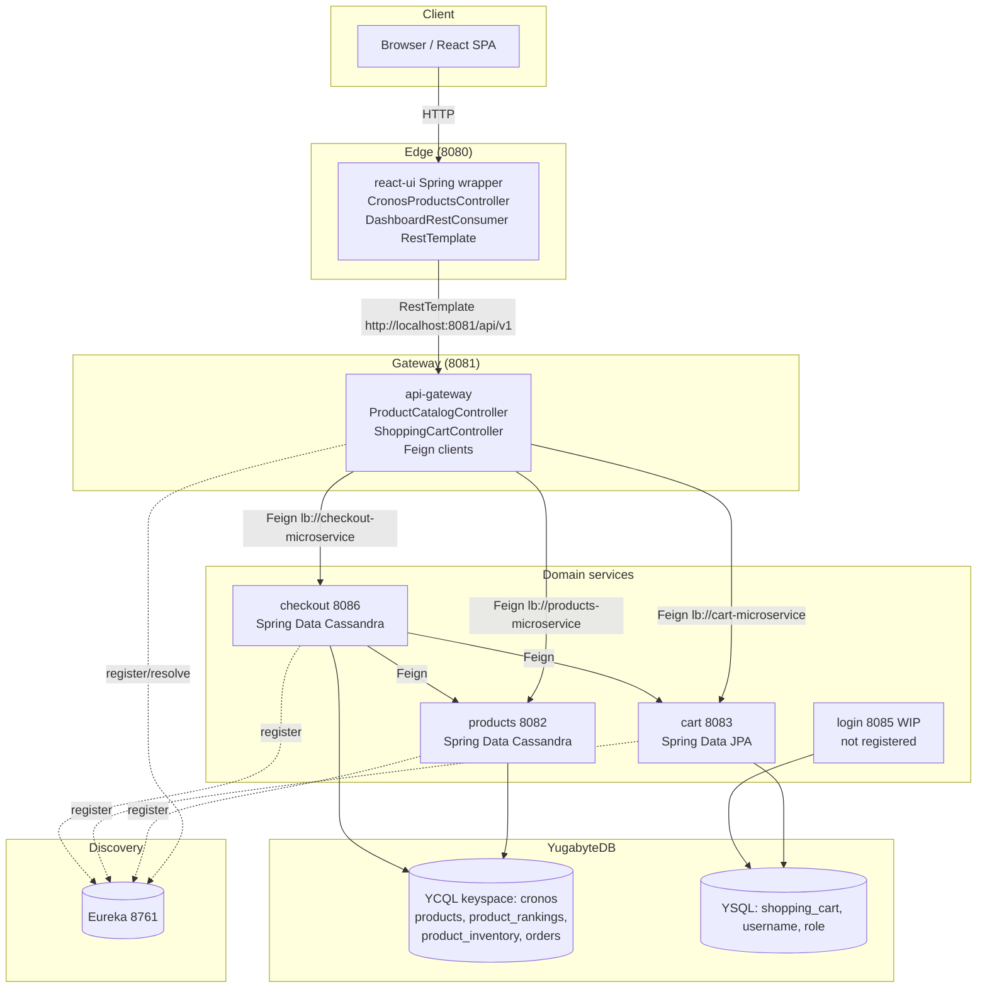
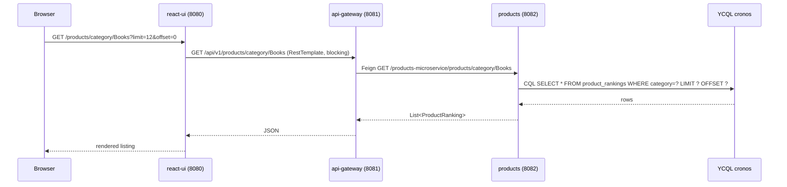
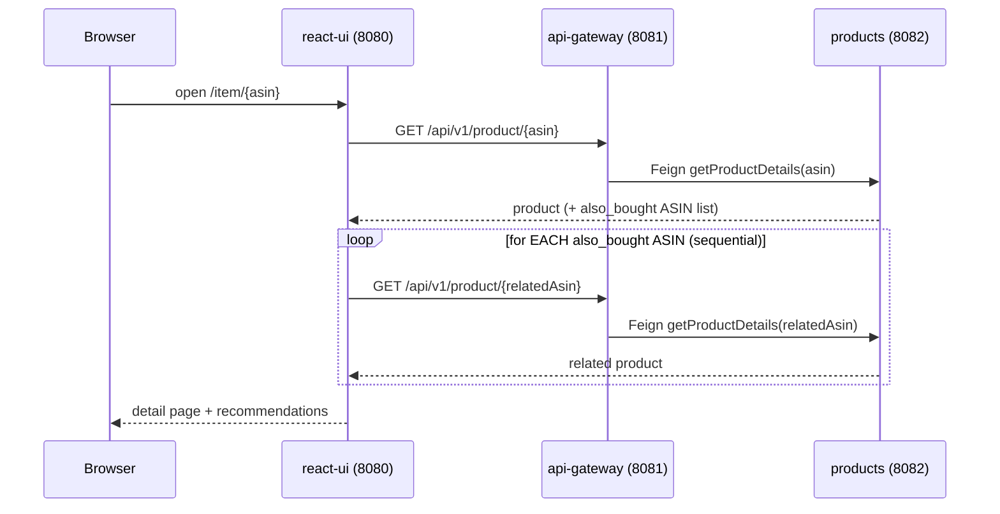
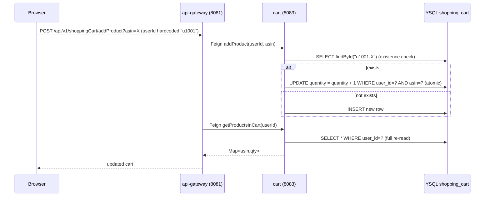
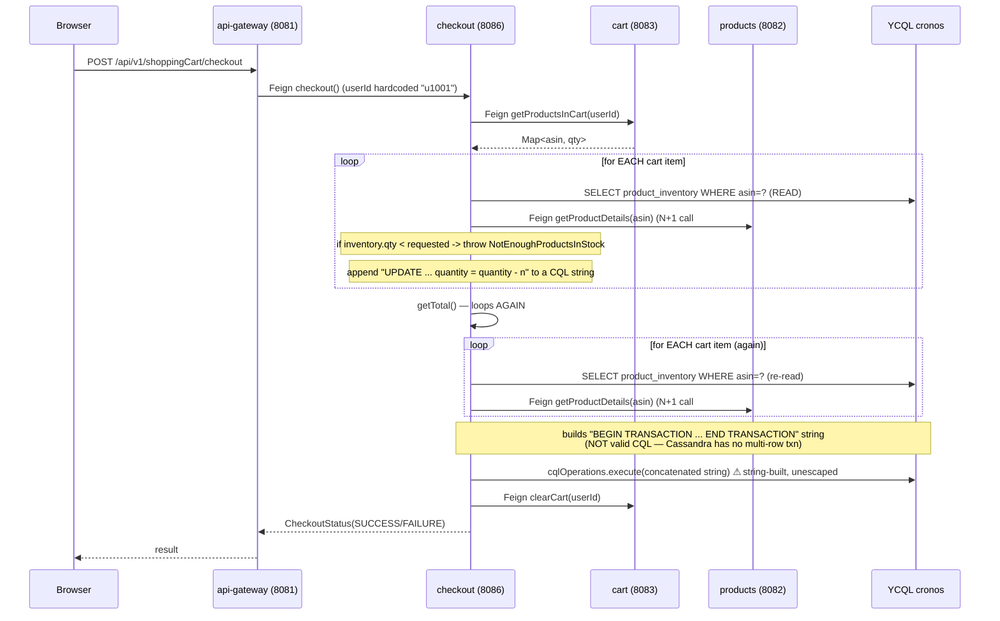

# Yugastore-Java — Solution Architecture Report

> **Author:** Solution Architecture review (Claude Code, read-only analysis)
> **Date:** 2026-06-01
> **Scope:** Full repository — 7 Maven modules, React UI, YugabyteDB data layer, deployment scripts.
> **Method:** Static read-only analysis of every Java source, config, schema, and the React frontend. No code was modified.

---

## 1. Executive Summary

Yugastore is a **sample microservices eCommerce marketplace** built to showcase YugabyteDB (distributed SQL) behind a Spring Boot / Spring Cloud microservice stack with a React UI. It is a **demo/reference application**, and the analysis should be read with that intent in mind — but the user-stated goal is to treat it as a real system, find bottlenecks, and establish baselines.

**Architecture in one line:** React UI (8080) → API Gateway (8081) → {Products (8082, YCQL), Cart (8083, YSQL), Checkout (8086, YCQL)}, all wired together through Eureka service discovery (8761), with a partially-built Login service (8085, YSQL).

**Overall health:**

| Dimension | Verdict |
|---|---|
| Architecture clarity | **Good** — clean service boundaries, single external entry point, discovery-based routing |
| Functional completeness | **Moderate** — browse / cart / checkout work; login is unfinished and not wired in |
| Production readiness | **Low** — by design; demo-grade resilience, security, and data-integrity guarantees |
| Data-integrity (checkout) | **Critical risk** — checkout is not atomic and can oversell inventory |
| Security posture | **Low** — all services `permitAll()`, hardcoded user IDs, empty DB passwords |
| Performance design | **Several systemic anti-patterns** — N+1 fan-out, offset pagination on Cassandra, no caching, no resilience |

**Top 5 things a real deployment would have to fix first:**
1. **Checkout is not atomic** and has a read-modify-write race → inventory oversell (correctness, CRITICAL).
2. **No resilience** anywhere — no timeouts, retries, or circuit breakers on inter-service calls.
3. **Identity is hardcoded** (`userId = "u1001"` / `"1"`) end-to-end → the app is effectively single-user.
4. **Offset pagination on YCQL** and **N+1 fan-out** on hot read paths → latency grows with catalog/cart size.
5. **Security is disabled** on every service (`permitAll`, CSRF off, empty passwords) and login isn't integrated.

---

## 2. Application Overview

### 2.1 What it does
A storefront where a user can:
- Browse a home page of best-sellers grouped by category (Books, Music, Beauty, Electronics).
- Browse/sort a category listing (by stars, reviews, buys, views).
- View a product detail page with "also bought" recommendations.
- Add/remove items to a shopping cart.
- Check out — which validates inventory, decrements stock, records an order, and clears the cart.
- (Intended) Register/login — implemented in isolation but **not integrated** into the storefront flow.

Sample dataset: ~6,000 products loaded from Amazon-style metadata via Python + `cassandra-loader` (`resources/dataload.sh`).

### 2.2 Technology stack

| Layer | Technology |
|---|---|
| Language / Runtime | Java 17 |
| Framework | Spring Boot 2.6.3, Spring Cloud 2021.0.0 (⇒ `javax.*`, **not** `jakarta.*`) |
| Service discovery | Netflix Eureka (`eureka-server-local`, 8761) |
| Inter-service RPC | Spring Cloud OpenFeign (declarative, Eureka-resolved, client-side load balanced) |
| API style | Spring Data REST (`@RepositoryRestResource`) + hand-written `@RestController`s |
| Datastore | YugabyteDB — **YCQL** (Cassandra-compatible) for products/checkout; **YSQL** (PostgreSQL-compatible) for cart/login |
| Data access | Spring Data Cassandra (YCQL), Spring Data JPA / Hibernate (YSQL) |
| UI | React 16.2, Create React App (react-scripts 1.1.1), React Router 4, axios + fetch, react-bootstrap |
| UI host | Spring Boot wrapper module (`react-ui`, 8080) that also proxies a few endpoints |
| Build | Maven multi-module (`./mvnw`), `frontend-maven-plugin` (Node 16 / npm 8) |
| Deploy | `docker-run.sh` (local Docker), Cloud Foundry `manifest.yml` per module |

### 2.3 Module / port map

| Module | Port | DB API | Role | Notes |
|---|---|---|---|---|
| `eureka-server-local` | 8761 | – | Service registry | Standalone; `registerWithEureka:false` |
| `react-ui` | 8080 | – | React storefront + Spring proxy | Talks only to the gateway |
| `api-gateway-microservice` | 8081 | – | Sole external entry point | **MVC + Feign**, not Spring Cloud Gateway/Zuul |
| `products-microservice` | 8082 | YCQL | Catalog, categories, sales-rank | Spring Data Cassandra |
| `cart-microservice` | 8083 | YSQL | Shopping cart (HA / low-latency target) | Spring Data JPA |
| `checkout-microservice` | 8086 | YCQL | Checkout, orders, inventory | **bootstrap.yaml port mismatch (8083)** |
| `login-microservice` | 8085 | YSQL | Auth (WIP) | No Eureka registration, not in docker-run |

---

## 3. Architecture

### 3.1 Component / dependency diagram



### 3.2 Key architectural observations

- **Single entry point is respected** — the React UI/proxy only ever calls the gateway (`http://localhost:8081/api/v1`), and peer services are reached via Feign + Eureka service IDs (no hardcoded peer host:port). Good adherence to the intended design.
- **The gateway is not a real gateway** — it is plain Spring MVC controllers delegating to Feign clients, not Spring Cloud Gateway or Zuul. There is no central cross-cutting routing, rate limiting, or auth filter; each downstream concern is hand-coded.
- **Two persistence stacks, deliberately** — YCQL for catalog/inventory/orders, YSQL for cart/login. This is the whole point of the demo (show both Yugabyte APIs) but means two very different consistency/query models in one app.
- **Checkout is itself a client** — it fans out to cart (read cart) and products (per-item details), making it the most coupled and latency-sensitive service.
- **Two layers of indirection on every read** — Browser → react-ui Spring proxy → gateway → service. The `react-ui` Spring controllers (`CronosProductsController` + `DashboardRestConsumer`, a blocking `RestTemplate`) add a hop that mostly re-exposes the gateway's API.
- **Login is orphaned** — no `bootstrap.yml`/Eureka registration, absent from `docker-run.sh`, no DDL in `schema.sql`, and the gateway has no auth integration. It is genuinely "work in progress."

---

## 4. Data Model

### 4.1 YCQL (keyspace `cronos`) — products & checkout

| Table | Partition key | Clustering key | Notable columns | Access pattern |
|---|---|---|---|---|
| `products` | `asin` | – | title, brand, price, categories (set), also_bought/also_viewed/bought_together (frozen lists), num_reviews, num_stars | Get product by ASIN |
| `product_rankings` | `asin` | `category` | sales_rank, title, price, imurl | By ASIN (all categories); **by category via secondary index** |
| `product_inventory` | `asin` | – | quantity | Stock read + decrement at checkout (transactions enabled) |
| `orders` | `order_id` | – | user_id, order_details, order_time, order_total | Insert at checkout |

- **Secondary index** on `product_rankings (category, sales_rank)` enables "top products in a category" — this is well-designed for the category browse path.
- **`orders` has no index on `user_id`** → "my order history" would require a full scan. (No such feature exists yet, but the model can't support it.)
- **`product_inventory` is a single-column partition per ASIN** → hot ASINs become contention points under concurrent checkout; YCQL serializes per-key updates.

### 4.2 YSQL — cart & login

```sql
-- resources/schema.sql (the ONLY YSQL DDL checked in)
CREATE TABLE shopping_cart(
  cart_key  TEXT NOT NULL,   -- PK, stored as "<userId>-<asin>"
  user_id   TEXT NOT NULL,
  asin      TEXT NOT NULL,
  time_added TEXT NOT NULL,  -- stored as a stringified LocalDateTime
  quantity  INT  NOT NULL,
  PRIMARY KEY (cart_key)
);
```

- **No index on `user_id`** despite every cart query filtering by `user_id` (`findProductsInCartByUserId`, `updateQuantityForShoppingCart`, `deleteProductsInCartByUserId`). This forces scans as the table grows.
- **Synthetic string PK** (`userId + "-" + asin`) instead of a real composite key — the `@Embeddable ShoppingCartKey` exists but is unused (dead code / tech debt). Breaks if an ID ever contains `-`.
- **`time_added` is TEXT**, populated from app-side `LocalDateTime.now()` → clock-skew across regions, no DB-side default.
- **`username` / `role` tables have no checked-in DDL** — login relies on Hibernate auto-DDL or pre-existing tables.

---

## 5. User Flows & Sequence Diagrams

### 5.1 Browse catalog / category



### 5.2 Product detail (illustrates N+1 on "also bought")


*Same N+1 shape also exists server-side in `ProductMetadataRestRepo.retrieveImageUrlsFromAsin()` (per-ASIN `findById` in a loop, capped at 10).*

### 5.3 Add to cart



### 5.4 Checkout (the critical, non-atomic flow)



**This diagram is the single most important finding in the report.** The check-then-decrement is not atomic, the "transaction" is a string that Cassandra cannot honor as multi-row ACID, product details are fetched `2N` times, and the order's `user_id` is hardcoded to `1`.

---

## 6. Bottlenecks & Risks (prioritized)

Severity reflects impact on a hypothetical real deployment. Confidence is the analyst's certainty in the finding.

### CRITICAL

| # | Finding | Location | Why it matters | Conf. |
|---|---|---|---|---|
| C1 | **Checkout not atomic + read-modify-write race** | `checkout/.../CheckoutServiceImpl.java:57-79` | Two concurrent checkouts both read stock=5, both decrement → **oversell**. No LWT/`IF` guard, no locking. | 0.95 |
| C2 | **"BEGIN TRANSACTION … END TRANSACTION" string executed against YCQL** | `CheckoutServiceImpl.java:50-79` | Not valid Cassandra CQL; there is no multi-row transaction. Inventory decrements and order insert can partially apply with no rollback. | 0.9 |
| C3 | **CQL built by string concatenation** | `CheckoutServiceImpl.java:66-77` | Unescaped `asin`/`order_details` → broken CQL on a quote; injection-shaped risk. | 0.9 |
| C4 | **No authentication/authorization anywhere** | every service `SecurityConfiguration` `permitAll()`, CSRF disabled | All Spring Data REST repositories are world-readable/writable; cart/inventory mutable by anyone. | 0.95 |

### HIGH

| # | Finding | Location | Why it matters | Conf. |
|---|---|---|---|---|
| H1 | **Hardcoded identity end-to-end** | gateway `ShoppingCartController:36` (`u1001`); `CheckoutController:25`; `createOrder` `setUser_id(1)` | App is effectively single-user; all carts/orders collide. | 0.95 |
| H2 | **N+1 fan-out on checkout (2N product calls)** | `CheckoutServiceImpl` loop (`:61`) + `getTotal()` (`:93`) | Checkout latency scales with cart size; double work because details fetched twice. | 0.9 |
| H3 | **N+1 on product detail + cart render (UI and server)** | `ShowProduct/index.js:34-46`, `Cart/index.js:18-20`, `ProductMetadataRestRepo:59-78` | Sequential per-item HTTP/DB calls; recommendations and cart views slow down with item count. | 0.9 |
| H4 | **Offset pagination on YCQL** | `ProductMetadataRepo:17` (`LIMIT ? OFFSET ?`), `ProductRankingRepository:17` | Cassandra/YCQL offset scans and discards preceding rows → cost grows linearly with page depth. | 0.85 |
| H5 | **No resilience: no timeouts/retries/circuit breakers** | all Feign clients; `react-ui CronosConfig:14` default RestTemplate | One slow/dead downstream stalls the whole call chain; cascading failure. | 0.9 |
| H6 | **Redundant cart DB round-trips** | `cart ShoppingCartImpl`: `getProductsInCart` queries twice (`:56,:58`); `removeProductFromCart` 3× `findById` (`:69-73`); `clearCart` checks before delete (`:94`) | 2–3× the necessary latency on the "must be low-latency" service. | 0.9 |
| H7 | **Hardcoded localhost DB/Eureka hosts** | `cart application.yml:18`, `bootstrap.yml`; checkout/products similar | Blocks multi-region/K8s deployment the README claims as a goal. | 0.85 |

### MEDIUM

| # | Finding | Location | Why it matters | Conf. |
|---|---|---|---|---|
| M1 | **Missing YSQL index on `shopping_cart(user_id)`** | `resources/schema.sql` | Every cart query filters by `user_id`; scans as table grows. | 0.85 |
| M2 | **Missing YCQL index on `orders(user_id)`** | `resources/schema.cql` | Order-history queries impossible without scan. | 0.8 |
| M3 | **`product_inventory` single-key hot partition** | `schema.cql:66-70` | Popular ASINs serialize under concurrent checkout. | 0.7 |
| M4 | **No caching on hot reads** (catalog, rankings) | products services; UI re-fetches each load | Repeated identical reads hit DB every time. | 0.8 |
| M5 | **Default HikariCP pool (10) untuned** | `cart application.yml` (no `hikari` block) | Insufficient concurrency under load. | 0.7 |
| M6 | **checkout `bootstrap.yaml` port = 8083** (conflicts with cart) | `checkout/.../bootstrap.yaml` | Config inconsistency vs `application.yaml:8086`; confusing/fragile. | 0.8 |
| M7 | **Login not integrated**: no Eureka reg, no DDL, absent from docker-run, no rate limiting, user-enumeration on registration | login module | Auth story incomplete; enumeration leaks account existence. | 0.85 |
| M8 | **Empty DB passwords in committed config** | `cart/login application.yml` (`password: ""`) | Not secret-managed; insecure default. | 0.85 |

### LOW

| # | Finding | Location |
|---|---|---|
| L1 | Mutating operations exposed over HTTP **GET** (cart add/remove/clear) | `cart ShoppingCartController` |
| L2 | Deprecated React lifecycles (`componentWillMount`, `componentWillReceiveProps`) | `App/index.js`, `ShowProduct/index.js` |
| L3 | Very old front-end deps (React 16.2, react-scripts 1.1.1, axios 0.18) — known CVEs likely | `react-ui/frontend/package.json` |
| L4 | `show-sql:true` + root `DEBUG/TRACE` logging in cart config | `cart application.yml` |
| L5 | App-side timestamps as strings (`time_added`) | `cart ShoppingCartImpl:85` |
| L6 | Dead code: unused `ShoppingCartKey`, `ProductInventoryRepo`, extra `react-ui` proxy hop | various |

---

## 7. Improvement Opportunities

Grouped by theme; each maps to findings above. (Recommendations only — no code was changed.)

### 7.1 Correctness & data integrity (do first)
- **Make inventory decrement atomic** with YCQL Lightweight Transactions: `UPDATE product_inventory SET quantity = quantity - ? WHERE asin = ? IF quantity >= ?` and act on the `[applied]` result. Removes the oversell race (C1) and the bogus multi-row "transaction" (C2). [→ C1, C2]
- **Use bound/prepared statements** for all inventory/order writes; never concatenate CQL. [→ C3]
- **Adopt a saga / compensation** for the cross-service checkout (decrement → order → clear cart) since true distributed ACID isn't available; record order state and compensate on failure. [→ C1, C2]
- **Propagate real `userId`** from an authenticated principal through gateway → cart → checkout; stop hardcoding `u1001`/`1`. [→ H1]

### 7.2 Performance
- **Batch the checkout reads**: fetch all product details once (single call / `IN` query), compute totals from that map, and drop the duplicate `getTotal()` loop — turns `2N` calls into ~1. [→ H2]
- **Batch/parallelize "also bought" and cart-render** fetches (single multi-ASIN endpoint, or parallel requests with a bound), both in the React UI and `ProductMetadataRestRepo`. [→ H3]
- **Replace offset pagination with keyset/cursor pagination** keyed on clustering columns for YCQL listing endpoints. [→ H4]
- **Add caching** (`@Cacheable` + Redis/Caffeine) on catalog-by-ASIN and category-ranking reads; these are read-heavy and rarely change. [→ M4]
- **Collapse the redundant cart round-trips** (single `findById`/`Optional` per op; skip existence-checks before delete; consider upsert/`ON CONFLICT`). [→ H6]
- **Add the missing indexes** (`shopping_cart(user_id)`, `orders(user_id)`) and **tune HikariCP**. [→ M1, M2, M5]

### 7.3 Resilience
- **Set Feign/RestTemplate connect+read timeouts** explicitly and add **Resilience4j circuit breakers + retries with backoff** on every inter-service call; add fallbacks where a degraded response is acceptable. [→ H5]
- **Connection pooling** for the HTTP clients (Apache/OkHttp under Feign).

### 7.4 Security
- **Turn on real auth**: integrate the login service, issue a token/session, enforce it at the gateway, and stop `permitAll()` on internal services (or lock them to the gateway's network). [→ C4, M7]
- **Lock down Spring Data REST** exposure — these auto-expose full CRUD over HTTP. Restrict methods/paths or front them with explicit controllers.
- **Externalize secrets** (no empty/committed passwords); use env/secret manager. [→ M8]
- **Add rate limiting** on login/registration and **fix user-enumeration** (uniform messages). [→ M7]
- **Upgrade front-end dependencies** (React, react-scripts, axios) to clear known CVEs. [→ L3]

### 7.5 Deployment / operability
- **Externalize all hosts** (DB, Eureka) via env vars to enable multi-region/K8s — the stated design goal. [→ H7]
- **Fix the checkout `bootstrap.yaml` port** and reconcile config sources. [→ M6]
- **Add login to `docker-run.sh`** and provide its DDL; add health-check based startup ordering. [→ M7]
- **Reduce indirection**: consider whether the `react-ui` Spring proxy hop is needed or whether the SPA can call the gateway directly (the CRA `proxy` already targets 8081).

---

## 8. Performance Baselines

There is **no existing performance test suite, CI pipeline, or recorded baseline** in the repo. Below are (a) the target SLAs the project's own QE rules define, and (b) a concrete, measurable baseline plan to capture *actual* numbers before any optimization. Establishing these is a prerequisite to claiming any improvement.

### 8.1 Target SLAs (from `.claude/rules/rules.md` — QE-Core)

| Metric | Target | Investigate / block if |
|---|---|---|
| API latency p95 | < 500 ms (baseline aim 200 ms) | > 500 ms |
| API latency p99 | < 1000 ms (baseline aim 500 ms) | > 1000 ms |
| UI page load p95 | < 2 s (≤ 3 s ceiling) | > 3 s |
| Throughput | sustain peak (> 1000 req/min target) without degradation | degradation under peak |
| Error rate at peak | < 0.1% | ≥ 0.1% |
| CPU at peak | < 80% | ≥ 80% |
| Memory leak | < 10 MB/hour (soak) | ≥ 10 MB/hour |
| Perf regression vs baseline | ≤ 10% | > 10% |

### 8.2 Endpoints to baseline (priority order)

| Rank | Endpoint (via gateway 8081) | Why | Expected risk |
|---|---|---|---|
| 1 | `POST /api/v1/shoppingCart/checkout` | Most complex, cross-service, non-atomic | High latency + correctness under concurrency |
| 2 | `GET /api/v1/products/category/{category}?limit&offset` | Hot browse path, offset paging | Latency grows with offset |
| 3 | `GET /api/v1/product/{asin}` + recommendations | N+1 on related products | Latency grows with related-item count |
| 4 | `GET /api/v1/products?limit&offset` | Catalog listing, offset paging | Same as #2 |
| 5 | `POST /api/v1/shoppingCart/addProduct` | Cart write path (low-latency target) | Redundant round-trips |
| 6 | `POST /api/v1/shoppingCart` (get cart) | Double-query in service | 2× latency |

### 8.3 How to capture the baseline (no tooling exists yet — proposed)

Per the project's tool rules, **Gatling** (JVM-native, CI-friendly assertions) or **JMeter** are the sanctioned load tools; **JaCoCo** for coverage. Suggested protocol:

1. **Environment**: single fixed-spec host (or controlled K8s), YugabyteDB with the full ~6K-product dataset loaded (`resources/dataload.sh`), all 7 services up, warmed (discard first 1–2 min).
2. **Load profile**: ramp `constantUsersPerSec` with think-time pauses; separate **read mix** (browse/detail) from **write mix** (add-to-cart/checkout). Run load / stress / spike / soak (4–24h for leaks).
3. **Capture, per endpoint**: p50/p90/p95/p99 latency, throughput (req/s), error rate; plus host CPU/mem and DB-side metrics.
4. **Concurrency correctness test for checkout** (special): N parallel checkouts of the same low-stock ASIN; assert final `quantity` never goes negative and order count == successful decrements. This directly exercises C1/C2.
5. **Gate**: encode Gatling assertions (`global.responseTime.percentile3.lt(500)`, `successfulRequests.percent.gt(99.0)`) so CI fails on regression > 10% once a pipeline exists.

### 8.4 Baseline scorecard template (to be filled by the first run)

| Endpoint | p50 | p95 | p99 | Throughput | Error % | Notes |
|---|---|---|---|---|---|---|
| checkout | _TBD_ | _TBD_ | _TBD_ | _TBD_ | _TBD_ | run concurrency-correctness variant too |
| products/category | _TBD_ | _TBD_ | _TBD_ | _TBD_ | _TBD_ | vary offset: 0 / 500 / 5000 to expose offset cost |
| product/{asin}+recs | _TBD_ | _TBD_ | _TBD_ | _TBD_ | _TBD_ | vary related-item count |
| products (list) | _TBD_ | _TBD_ | _TBD_ | _TBD_ | _TBD_ | |
| addProduct | _TBD_ | _TBD_ | _TBD_ | _TBD_ | _TBD_ | |
| get cart | _TBD_ | _TBD_ | _TBD_ | _TBD_ | _TBD_ | |

> **Predicted hotspots before measuring** (hypotheses to confirm): checkout p95 will exceed 500 ms as cart size grows (H2); category latency will degrade sharply at high offset (H4); cart write latency will be ~2–3× the theoretical minimum (H6). These are the highest-value places to measure first because they map directly to the structural findings.

---

## 9. Appendix — Files Reviewed (representative)

- **Gateway**: `controller/{ProductCatalog,ShoppingCart}Controller.java`, `rest/clients/*RestClient.java`, `service/impl/*.java`, `config/{SecurityConfiguration,CustomRestMvcConfiguration}.java`
- **products**: `domain/*`, `repo/{ProductMetadataRepo,ProductRankingRepository,ProductInventoryRepository,rest/ProductMetadataRestRepo}.java`, `service/impl/*`, `config/YugabyteYCQLConfig.java`
- **cart**: `domain/{ShoppingCart,ShoppingCartKey}.java`, `repositories/ShoppingCartRepository.java`, `service/ShoppingCartImpl.java`, `controller/ShoppingCartController.java`, `application.yml`, `bootstrap.yml`
- **checkout**: `service/CheckoutServiceImpl.java`, `controller/CheckoutController.java`, `repositories/*`, `rest/clients/*`, `config/Yugabyte{Local,Cloud}Config.java`, `application.yaml`, `bootstrap.yaml`
- **login**: `model/{User,Role}.java`, `repo/*`, `service/*`, `web/UserController.java`, `WebSecurityConfig.java`, `SecurityConfig.java`
- **eureka**: `YugastoreEurekaServer.java`, `application.yml`
- **react-ui**: `controller/CronosProductsController.java`, `rest/DashboardRestConsumer.java`, `config/CronosConfig.java`; `frontend/src/components/{App,Products,ShowProduct,Cart,Home}/index.js`, `frontend/package.json`
- **data/deploy**: `resources/schema.cql`, `resources/schema.sql`, `resources/dataload.sh`, `docker-run.sh`, `*/manifest.yml`, `README.md`

---

*End of report. Read-only analysis — no source files were modified.*
